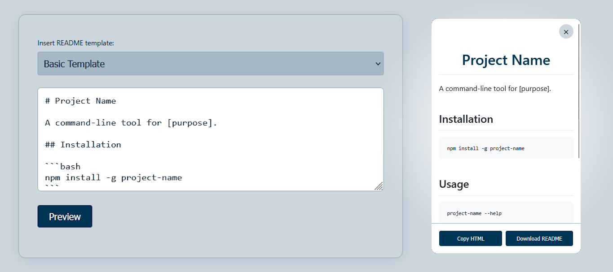

<h5>README</h5>

<h1>READKEI.md</h1>

<a href="https://keiblackley.github.io/READKEI.md">View Demo</a> - <a href="README.md">Documentation</a> - <a href="https://github.com/KeiBlackley/README.md/issues/">Report Bug</a> - <a href="https://github.com/KeiBlackley/README.md/issues/">Request Feature</a>

<h2>Table of Contents</h2>
<ul>
<li><a href="https://keiblackley.github.io/READKEI.md">Demo</a></li>
<li><a href="#about-this-project">About This Project</a><ul>
<li><a href="#screenshots">Screenshots</a></li>
<li><a href="#features">Features</a></li>
</ul>
</li>
<li><a href="#quick-start">Quick Start</a></li>
<li><a href="#project-structure">Project Structure</a></li>
<li><a href="#technical-details">Technical Details</a><ul>
<li><a href="#how-it-works">How It Works</a></li>
</ul></li>
<li><a href="#license">Licence</a></li>
</ul>

<h2>About This Project</h2>

A simple, responsive Markdown editor and previewer inspired by GitHub’s README style. No backend or GitHub API required—everything runs locally in your browser.

<h3>Screenshots</h3>
<blockquote> Editor and Preview

</blockquote>
<h3>Features</h3>
<ul>
<li><strong>Markdown Preview</strong>: See your README rendered in a GitHub-like style.</li>
<li><strong>Template Dropdown</strong>: Quickly start with a basic, application, or styled README template.</li>
<li><strong>Overlay Preview</strong>: Preview your markdown in a modal overlay.</li>
<li><strong>Copy HTML &amp; Download</strong>: Copy the rendered HTML or download your markdown as a README file.</li>
<li><strong>Dark Mode Toggle</strong>: Switch between light and dark themes.</li>
<li><strong>Responsive Design</strong>: Works on desktop and mobile.</li>
<li><strong>Offline Fallback</strong>: Templates load from local files or hardcoded fallback if fetch fails.</li>
<li><strong>Internet Connection Check</strong>: Loader checks for connectivity and displays an error if offline.</li>
</ul>

( <a href="#readme">back to top</a> )

<h2>Quick Start</h2>
<ol>
<li>Visit <a href="https://keiblackley.github.io/READKEI.md">https://keiblackley.github.io/READKEI.md</a> 

<strong>OR</strong> 
Open <code>index.html</code> in your browser.</li>
<li>Select a template or write your own markdown.</li>
<li>Click <strong>Preview</strong> to see the rendered README.</li>
<li>Use <strong>Copy HTML</strong> or <strong>Download README</strong> in the preview overlay.</li>
<li>Toggle dark mode with the header button.</li>
</ol>

( <a href="#readme">back to top</a> )

<h2>Project Structure</h2>
<pre><code>READKEi.md/
├── css/
│   ├── theme.css         # App layout, modal, buttons, dark mode, responsive
│   └── readme.css        # GitHub-style markdown preview
├── scripts/
│   └── main.js           # All app logic (preview, templates, overlay, loader)
├── templates/
│   ├── basic.md
│   ├── application.md
│   └── styled.md
├── docs/
│   ├── header.png
│   └── screenshot.png
└── index.html            # Main UI
</code></pre>

( <a href="#readme">back to top</a> )

<h2>Technical Details</h2>
<ul>
<li><a href="https://marked.js.org/" target="_blank">Marked.js</a> - Markdown Library</li>
<li><a href="https://fontawesome.com/" target="_blank">Font Awesome</a> - Icon Library</li>
</ul>
<h3>How It Works</h3>
<ul>
<li><strong>Markdown Rendering</strong>: Uses <a href="https://github.com/markedjs/marked">Marked.js</a> for fast, reliable parsing.</li>
<li><strong>Preview Modal</strong>: Shows your README in a styled overlay, with scrollable content and sticky footer.</li>
<li><strong>Template Loading</strong>: Tries to fetch markdown templates; falls back to hardcoded ones if fetch fails (e.g., when opened locally).</li>
<li><strong>Loader</strong>: Checks internet connection on page load and displays an error if offline.</li>
</ul>

( <a href="#readme">back to top</a> )

<h2>License</h2>

MIT License - see <a href="LICENSE">LICENSE</a> for details.

( <a href="#readme">back to top</a> )

